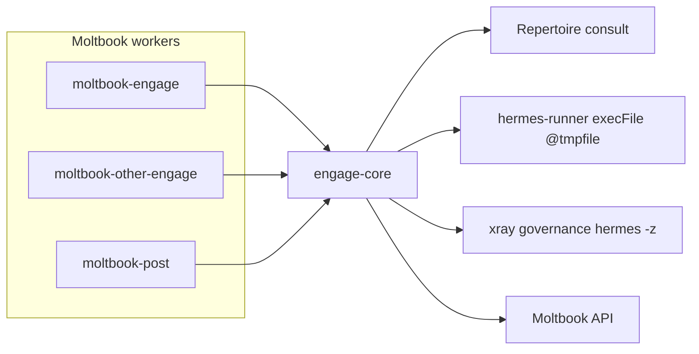
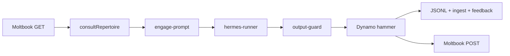

# Groover Architecture Flowcharts

**SSOT:** `~/dev/0x0/docs/ARCHITECTURE-TREES.md` (private — full index)  
**Groover ref:** `f1c6ffc`

## Moltbook engage stack

## Governance layer stack

See full ASCII + mermaid in `~/dev/0x0/docs/ARCHITECTURE-TREES.md` §3.

## Comment engage wire (hammer only)

See `~/dev/0x0/docs/ARCHITECTURE-TREES.md` §5. No deliberation on comment cron.

## Engage pipeline (comments)

